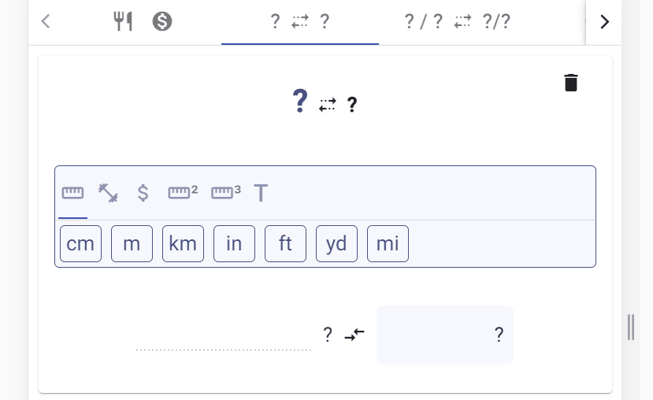

# EasyCA

Petite application comportant quelques outils pratiques pour son arrivée au Canada.

Cette application peut être ajouté comme application mobile (PWA).

Contiens actuellement :
- une aide pour le calcul du prix TTC et des pourboires.

- une aide à la conversion d'unité (longueur, température, poids et devises).

- l'heure dans quelques pays d'Europe.